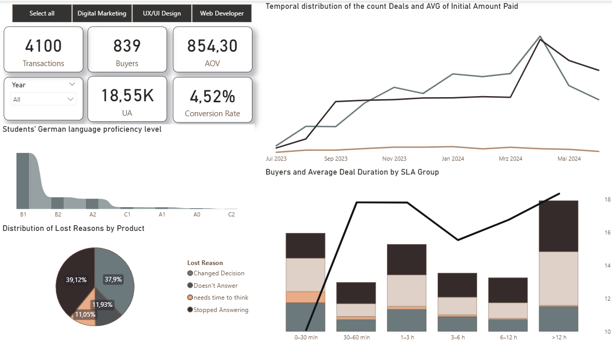
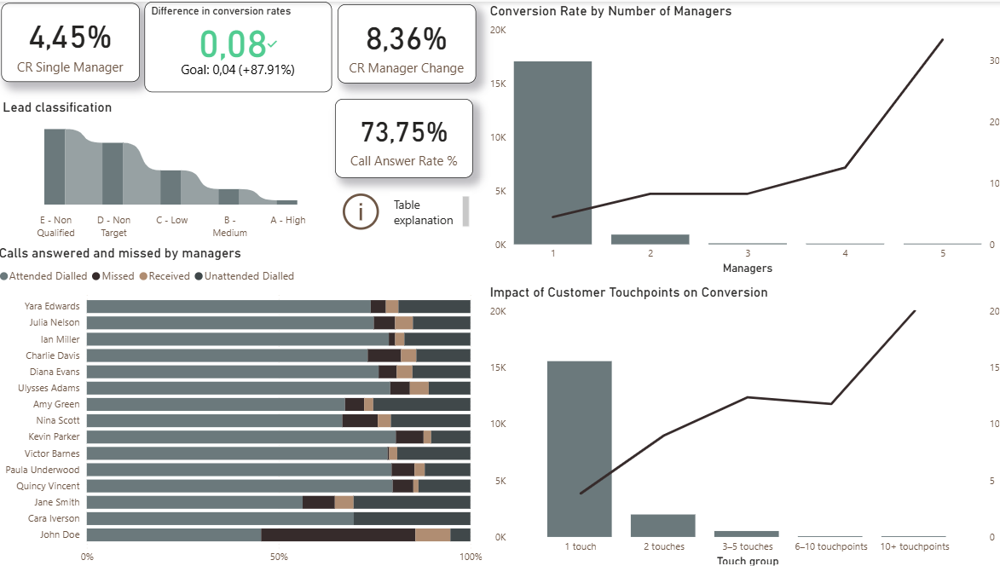
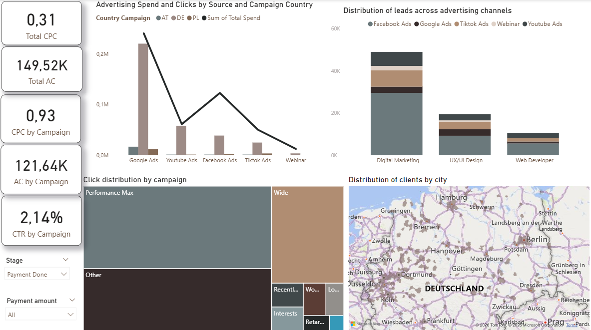
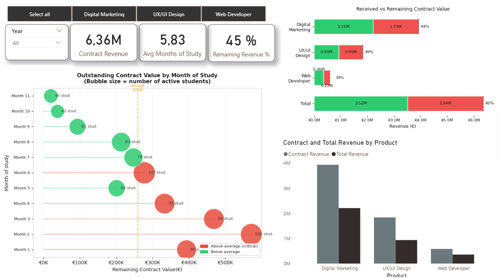
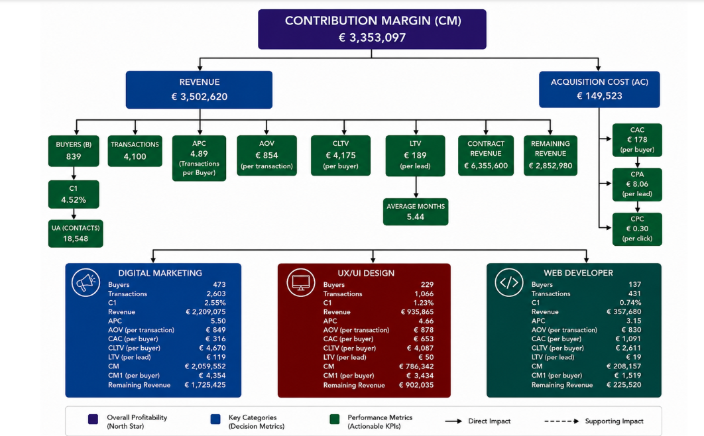

# CRM & Product Analytics for an Online Programming School | Python | Power BI

An end-to-end analytics capstone project for an online programming school, covering the full pipeline from raw CRM data to an interactive Power BI dashboard and a full product-analytics deliverable: unit economics, a metrics tree, and data-driven growth hypotheses with A/B test designs.

## 🎯 Business Goal

Clean and model raw CRM data across four interconnected tables — Deals, Calls, Contacts, and Spend — to identify conversion bottlenecks, revenue patterns, and growth opportunities, and translate those findings into a testable growth roadmap.

## 🧹 Data Cleaning & Preparation (Python)

The data was intentionally messy, as in any real-world CRM — 4 tables, 156,000+ combined rows (Deals: 21,593 • Calls: 95,874 • Contacts: 18,548 • Spend: 20,779).

Key data issues identified and resolved:

* Mixed data types — amounts stored as strings (`€ 3.500,00`), SLA stored as both `datetime.time` and `datetime.timedelta` within the same column
* City field contained full street addresses, country names, and postal codes instead of city names — extracted with regex
* German language level field contained Cyrillic transliterations of Latin letters, free-text manager notes, and 216 unique raw values
* 88% of City values were missing — traced to a business process (managers only fill it in at contract signing), not a data error
* Payment amounts were swapped in 21 rows (Initial Amount > Offer Total) — identified as a systematic entry error and corrected

**Technical highlights:**

* Converted date fields to `datetime`, IDs from `float64` to string to prevent precision loss on large IDs
* Built a regex-based city extractor handling varied address formats
* Normalized German language levels (Cyrillic → Latin, extracted from free text) and added a `Level_status` column (confirmed / in_progress / unclear)
* Recalculated Revenue using: `Initial + (Offer − Initial) / (CourseDuration − 1) × (MonthsStudied − 1)`
* Engineered new features: Deal Duration, SLA (hours), City_clean, Revenue, Unrealized Revenue
* Saved all 4 cleaned tables in **Parquet** format for fast downstream loading

**💡 Key insight:** Out of 18,548 contacts, only 839 became paying students — a 4.52% conversion rate. Leads grew 648% over the year while buyers stayed flat: the bottleneck is sales funnel quality, not traffic volume.

## 📊 Dashboard Overview (Power BI)

A 5-page interactive Power BI dashboard built on top of the cleaned data.

### 1️⃣ Deals — Sales Funnel

KPI cards (Transactions, Buyers, AOV, UA, Conversion Rate), leads vs. buyers vs. average payment over time, German language level distribution, lost-reason breakdown by product, buyers & deal duration by SLA response-time group.

### 2️⃣ Calls & Managers

Call answer rate by manager, conversion rate by number of managers per contact, conversion rate by number of customer touchpoints, Python-powered conversion table with color-coded segments.

### 3️⃣ Marketing

KPI cards (Total CPC, Total AC, CTR by Campaign), spend & clicks by source and campaign country, click distribution by campaign audience (treemap), geographic client distribution across Germany, lead quality classification.

### 4️⃣ Revenue & Retention

KPI cards (Remaining Revenue %, Avg Months of Study, Contract Revenue), Outstanding Contract Value by month of study (bubble chart, critical vs. stable months), Received vs. Remaining Contract Value by product, Contract vs. Total Revenue by product.

### 5️⃣ Product Metrics Tree

Visual breakdown of the full metrics tree: Contribution Margin → Revenue & Acquisition Cost → Buyers, Conversion Rate, APC, CLTV, LTV, CAC, CPA, CPC — by product.

**Technical highlights:**

* DAX measures for all KPIs with consistent filter logic (Stage = Payment Done, Initial Amount > 1)
* Aggregated `Spend_agg` table to avoid a many-to-many relationship with Deals
* Data model with 3 relationships: Deals → Contacts → Calls, and Deals → Spend_agg
* Python visuals embedded directly in Power BI (custom table, lollipop chart)
* Bookmarks and product filter buttons for interactivity

**💡 Key insight:** €2.85M of Remaining Revenue is already under contract — the school doesn't need new clients to unlock it. Retaining students through month 11 is the highest-ROI action available right now.

## 📈 Product Analytics: Unit Economics & Growth Hypotheses

### Unit Economics by product

| Product | Students | Revenue | AOV | CAC | CM1 |
|---|---|---|---|---|---|
| Digital Marketing | 469 | €2.21M | €4,660 | €319 | €4,342 |
| UX/UI Design | 226 | €0.93M | €4,087 | €662 | €3,425 |
| Web Developer | 135 | €0.36M | €2,611 | €1,108 | €1,503 |
| **Total** | **839** | **€3.50M** | **€4,175** | **€178** | **€3,997** |

### Metrics Tree

Revenue breaks down as: Buyers × CLTV → driven by Conversion Rate (4.52%), Unique Contacts (18,548), APC (€1,133), Avg Months (5.44), Acquisition Cost (€149K), CPA (€8.06).

### Growth Hypotheses (with A/B test design)

* **H1 — Increase Conversion Rate (+10% MDE):** Data shows a 30-min callback SLA and 3–5 touchpoints drive the most buyers. Proposed test: current process vs. new SLA protocol, 2-week duration.
* **H2 — Reduce CAC by 10%:** 64% of leads are non-target (D/E quality); Retargeting is underutilized despite higher conversion potential. Proposed test: current vs. reallocated ad budget (Wide → Retargeting/Lookalike), 2-week duration.

Sample sizes calculated using the Evan Miller formula: `n = 16 × p × (1−p) / Δ²`

### Scenario Analysis (+5% per metric)

AOV/APC +5% delivers the highest CM1 improvement across all products (e.g. Digital Marketing: €4,342 → €4,575 per buyer).

**💡 Key insight:** H3 has the highest financial potential (€2.85M already contracted). H1 is the quickest win. H2 requires marketing involvement but delivers sustainable CAC reduction. Together, the three hypotheses address all three levers of the unit economics model: Conversion Rate, APC, and Acquisition Cost.

## 🛠️ Tools

Python, Pandas, PyArrow / Parquet, Power BI, Power Query, DAX, Matplotlib, SciPy, Excel.

## 📂 Project Files
* [Power BI Dashboard (.pbix)](Final%20Project%20Analitycs.pbix)
* [Calls — Data Cleaning (.ipynb)](Calls.ipynb)
  
